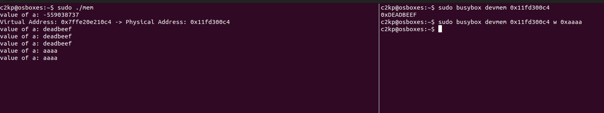
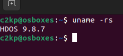

# Exercise 2:
- Code looks like below. The idea to parse the pagemap entry, and get the physcial address.

```C
#include <fcntl.h>
#include <stdint.h>
#include <stdio.h>
#include <unistd.h>

#define PAGE_SHIFT 12
#define PAGE_SIZE (1UL << PAGE_SHIFT)
#define PFN_MASK 0x7FFFFFFFFFFFFF

// Function to get the physical address using open, pread, etc.
uint64_t get_physical_addr(uint64_t virtual_addr) {
  int fd;
  uint64_t value;
  uint64_t offset = (virtual_addr / PAGE_SIZE) * sizeof(uint64_t);
  uint64_t page_frame_number;
  char pagemap_file[BUFSIZ];
  snprintf(pagemap_file, sizeof(pagemap_file), "/proc/%ju/pagemap",
           (uintmax_t)getpid());

  // Open the pagemap file using low-level system call open
  fd = open(pagemap_file, O_RDONLY);
  if (fd < 0) {
    perror("Error opening pagemap");
    return -1;
  }

  // Use pread to read the pagemap entry at the correct offset
  if (pread(fd, &value, sizeof(uint64_t), offset) != sizeof(uint64_t)) {
    perror("Error reading pagemap");
    close(fd);
    return -1;
  }

  close(fd);

  // Check if the page is present
  if (!(value & (1ULL << 63))) {
    printf("Page not present\n");
    return -1;
  }

  // Extract the page frame number (PFN) and calculate physical address
  page_frame_number = value & PFN_MASK;
  uint64_t physical_addr =
      (page_frame_number * PAGE_SIZE) + (virtual_addr % PAGE_SIZE);

  return physical_addr;
}

int main(int argc, char **argv) {

  volatile int a = 0xdeadbeef;
  printf("value of a: %d\n", a);

  uint64_t virtual_addr = (uint64_t)&a;
  uint64_t physical_addr = get_physical_addr(virtual_addr);

  if (physical_addr != (uint64_t)-1) {
    printf("Virtual Address: 0x%lx -> Physical Address: 0x%lx\n", virtual_addr,
           physical_addr);
  }

  while (1) {
    sleep(10);
    printf("value of a: %x\n", a);
  }

  return 0;
}
```
- Using menuconfig to turn of filter access on /dev/mem
- Disable Page aligned attribute for kernel. This option will stop the fine-grain control over how page table caches certain area of memory: add the following line to `/etc/default/grub`: GRUB_CMDLINE_LINUX_DEFAULT="nopat".
- Build the system as exercise 3.
- The result should be like below:



# Exercise 3:
- Create the config file based on the current configuration of the current kernel and loadded modules.
```bash
lsmod > /tmp/lsmod.now
make LSMOD=/tmp/lsmod.now localmodconfig
```
- At include/linux/uts.h:
```C
#define UTS_SYSNAME "HDOS"
```
- At the top level Makefile, change the version like the following:
```Makefile
VERSION = 9
PATCHLEVEL = 8
SUBLEVEL = 7
```
- Disable key revocation on Ubuntu
```bash
scripts/config --disable SYSTEM_REVOCATION_KEYS
```
- Build kernel
```bash
make -j8 2>&1 | tee out.txt
```
- Install the modules
```bash
sudo make modules_install
```

- Install the initramfs
```bash
sudo make install
```

- Reboot and `uname -rs`




